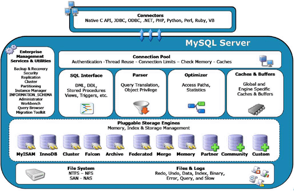

# Intro

## MySQL 101

Goal:

  - What is a database
  - ACID and non-ACID database
  - The CAP Theorem
  - MySQL HLA
    - Connections
    - Processing
    - Storing
  - Memory & Disk usage

# What is a database

## What is a database

  - Adding data: a single-connection in-memory database. Key-Value stores. Memory fragmentation.
  
  - Durability: making data persistent. Checkpoints. Memory vs Storage speed. I/O bound.
    
  - Buffering: serving requests during checkpoints. Paging mechanism.
  
  - Performance impacts of durability.

## What is a database

  - Isolation: serving multiple connections. Synchronization. CPU bound.
  
  - Reading data: finding data. Indexes. Indexes are not a free ride. 
    
  - Caching: Memory vs Storage speed. Index memory. Memory is not $\infty$. Fragmentation.

  - SQL: adding a language layer. Overhead of SQL. Optimization. 

## What is a database

  - Consistency. Repeatable reads.
  
  - Atomicity: all or nothing.
  
  - Transactions. Managing multiple queries. Rolling back. Transaction logs.

# MySQL Overview
## High Level Architecture

## MySQL HLA

  - Connection (TCP, Unix, Threads, Authentication) 
    
        --skip-name-resolve || --host-cache-size to grow internal cache

  - SQL Parser / Optimizer (Caches, Authorization)

  - Query exec / cache / logging

  - Storage Engines (Disk, Memory, Network)

 
## Memory usage
  - Connections
  - Internal Buffer/Caches
  - OS Buffer/Caches

## Storage Engines

  - Enable persistency
  - Transactional: InnoDB, NDB
  - Non Transactional: MyISAM, Memory,
  
  
